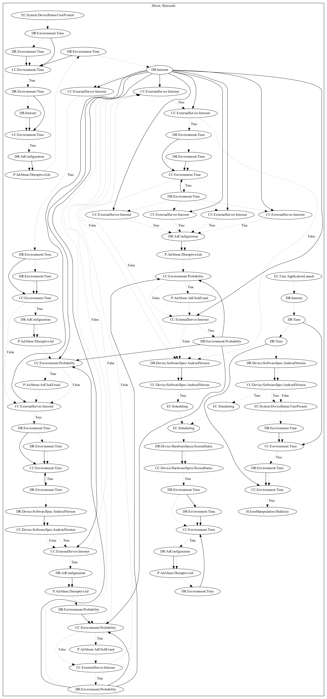

# HidenAdHRXH

## High-level Description

* Year: 2019
* Blog: https://www.trendmicro.com/en_us/research/19/h/adware-posing-as-85-photography-and-gaming-apps-on-google-play-installed-over-8-million-times.html

This malware application aims to disruptively push ads to the user. On application launch, the malware dynamically registers device status system event and checks that a set amount of time has past before hiding the app icon. The malware also listens on device status system events and checks after a set time passes before retrieving ad configuration from the internet. It then starts multiple services that check whether the configuration enables the service and a set amount of time has past before pushing ads disruptively to the user. If all conditions are met, the malware additionally performs a probability roll to determine whether the app should perform ad-click fraud.

## Signature
---

The image of the signature can be downloaded [here](../../img/signatures/HiddenAdHRXH.png) for closer inspection.

