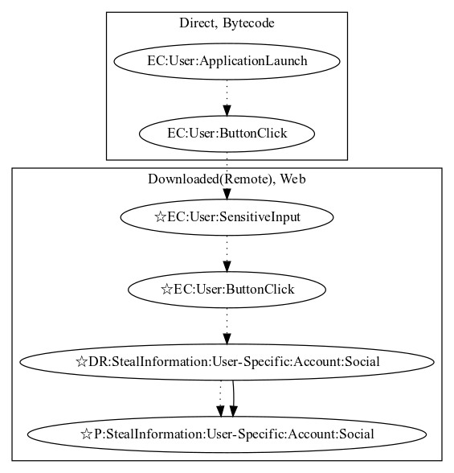

# Inazigram

## High-level Description

* Year: 2017
* Blog: https://www.welivesecurity.com/2017/03/09/new-instagram-credentials-stealers-discovered-google-play/

This malware application aims to steal instagram social account information from the user. A fake web phishing page is shown to the user on application launch. The malware developer steals the users instagram credentials when the user attempts to login (an observed behavior, as the phishing site was down).

## Signature
---

The image of the signature can be downloaded [here](../../img/signatures/Inazigram.png) for closer inspection.

