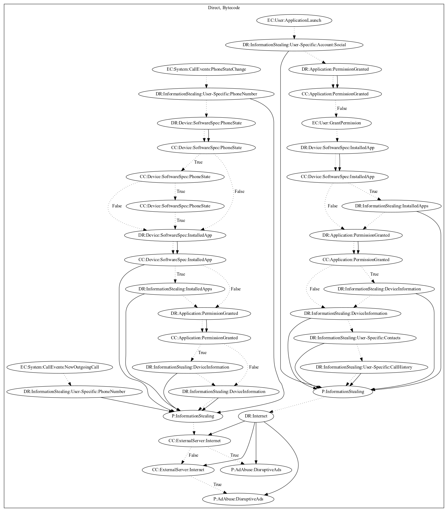

# IndexY

## High-level Description

* Year: 2019
* Blog: https://research.checkpoint.com/2019/the-eye-on-the-nile/

This malware application aims to leak device and user-specific information. On application launch, the malware retrieves social accounts, device information, contacts, and call history. It then leaks the information and retrieves configuration from the malware developers server. The malware also registers call system events. On new outgoing calls, the malware records the phone number. On phone state changes, the malware retrieves device information and leaks it to the malware developers server. It then checks configuration retrieved from application launch before pushing ads disruptively to the user.

## Signature
---

The image of the signature can be downloaded [here](../../img/signatures/IndexY.png) for closer inspection.

