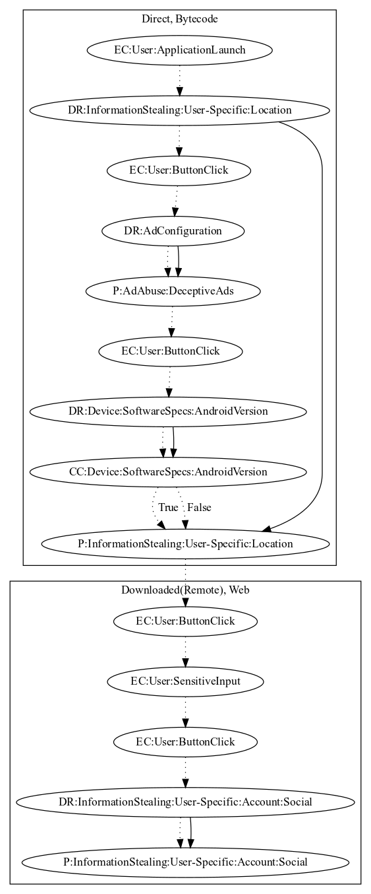

# InstaDetector

## High-level Description

* Year: 2016
* Blog: https://www.pandasecurity.com/mediacenter/social-media/we-know-whos-viewed-your-instagram-and-its-not-who-you-think/, https://securelist.com/who-viewed-you-instagram-account-and-who-stole-your-password/74260/

This malware application aims to steal instagram credentials. On application launch, the malware retrieves location information. Once the user presses the begin button, an ad is disruptively pushed to the user before leaking the location information and opening a phishing page within a WebView. The phishing page contains a login form where the user performs a sensitive input and clicks a button to "log in", leaking the credentials as a result.

## Signature
---

The image of the signature can be downloaded [here](../../img/signatures/InstaDetector.png) for closer inspection.

