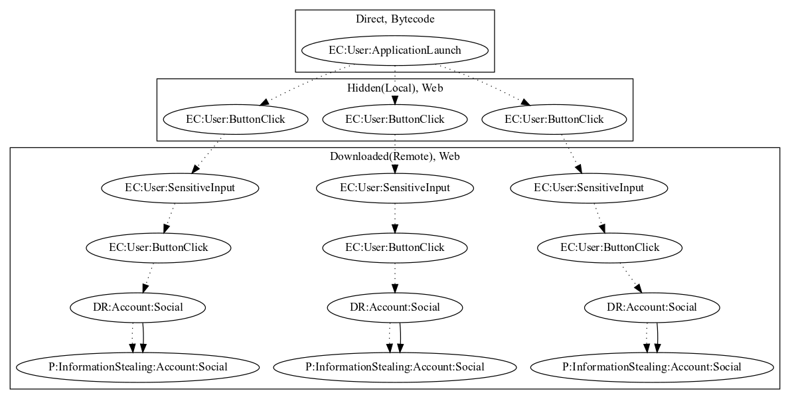

# InstaZuna

## High-level Description

* Year: 2017
* Blog: https://securingtomorrow.mcafee.com/other-blogs/mcafee-labs/turkish-instagram-password-stealers-found-google-play/

This malware application aims to steal instagram credentials from the user. Upon launch of the application, the app launches a local website that contains three links. All three links lead to fake login pages. Once the user clicks on the link, performs a sensitive input, and clicks a button to login, the credentials are sent to the malware developer as a result.

## Signature
---

The image of the signature can be downloaded [here](../../img/signatures/InstaZuna.png) for closer inspection.

