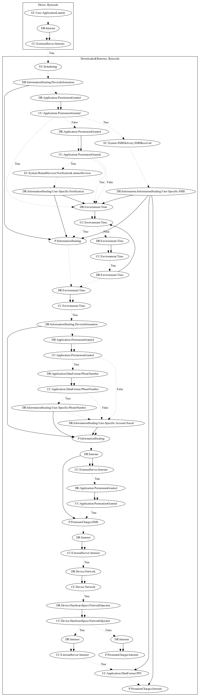

# Joker

## High-level Description

* Year: 2020
* Blog: https://www.pandasecurity.com/en/mediacenter/mobile-news/joker-malware/

This malware application aims to steal user-specific information and perform various premium charges on the device. Upon launch, it downloads a remote payload which immediately registers two system events to retrieve SMS/notification information. After a set of time checks, it then attempts to register the device to the malware developers server leaking device and user-specific information as a result. On response, the server sends back a short code in which the malware sends out to perform premium service charges via SMS. Lastly, the malware also attempts to perform WAP billing charges. If the malware is of a particular network operator, the malware attempts to subscribe the device to mobilelife premium services. Otherwise, the malware subscribes the device to vodafone premium services.

## Signature
---

The image of the signature can be downloaded [here](../../img/signatures/Joker.png) for closer inspection.

