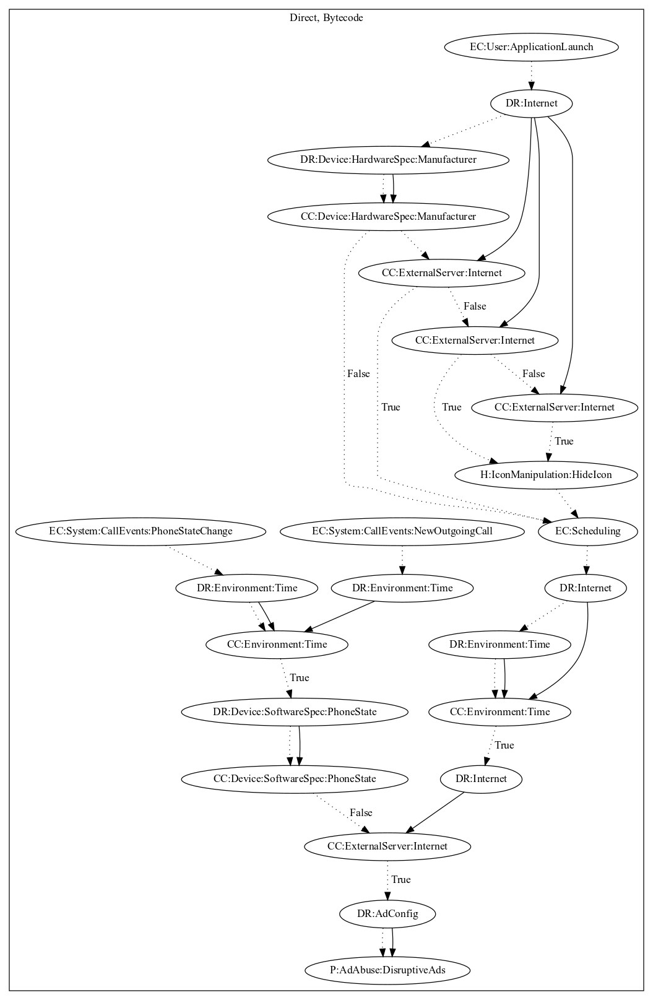

# LightsOut

## High-level Description

* Year: 2018
* Blog: https://research.checkpoint.com/2018/malicious-flashlight-apps-google-play/

This malware application aims to push full screen ads. The malware retrieves configuration from the internet on application launch. It then checks that the device is of a certain manufacturer (must not be xiaomi, huawei, vivo, or oppo phone) and commands from the server before hiding the app icon. The malware collects additional configuration from the server after a set period of time. On call events (new outgoing call, phone state change), the malware checks whether a call was hung up and attempts to push ads disruptively to the user depending on commands from application launch.

## Signature
---

The image of the signature can be downloaded [here](../../img/signatures/LightsOut.png) for closer inspection.

