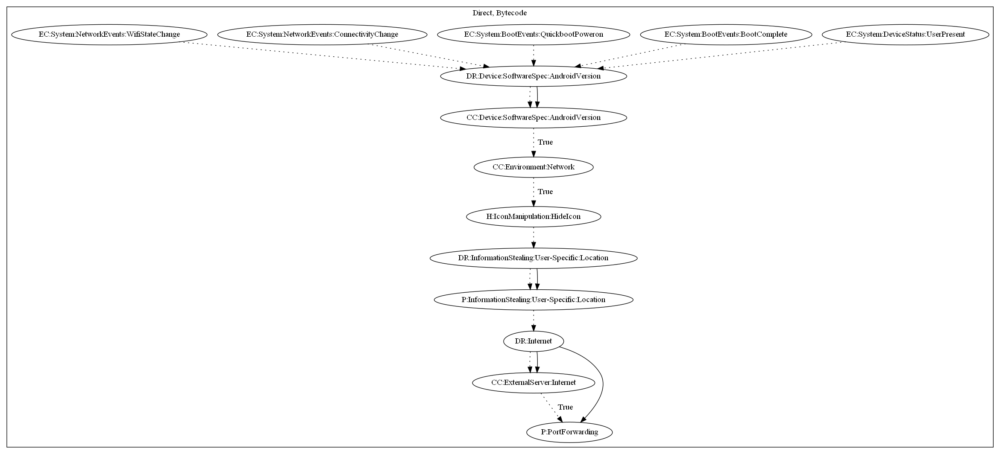

# MilkyDoor

## High-level Description

* Year: 2017
* Blog: https://blog.trendmicro.com/trendlabs-security-intelligence/dresscode-android-malware-finds-successor-milkydoor/

This malware sample aims to allow the malware developer access into the users internal network. The malware sample hides it's icon on a series of network events (Wifi State Change, Connectivity Change), boot events (Boot Complete), and device status (User Present). It then leaks the location of the user to the malware developers server. Commands and port configuration are sent as a response from the server. The malware uses the configuration to performs port forwarding -- granting access into the users internal network.

## Signature
---

The image of the signature can be downloaded [here](../../img/signatures/MilkyDoor.png) for closer inspection.

