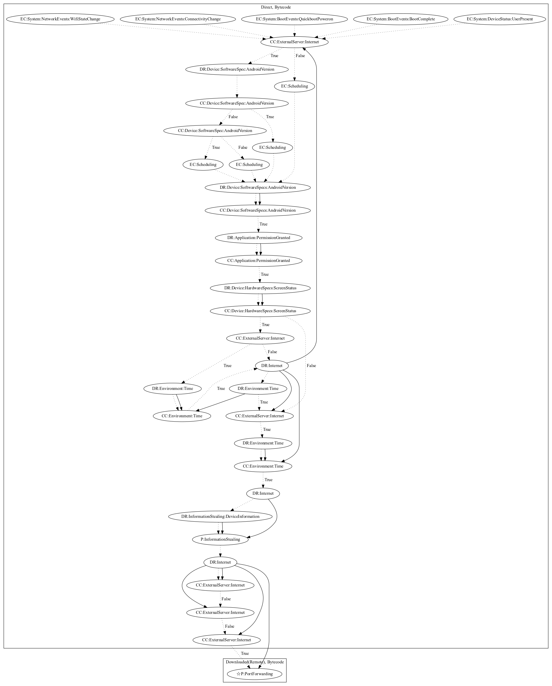

# MilkyDoor

## High-level Description

* Year: 2017
* Blog: https://blog.trendmicro.com/trendlabs-security-intelligence/dresscode-android-malware-finds-successor-milkydoor/

This app is part of the MilkyDoor Android malware family, which uses remote port forwarding via Secure Shell (SSH) tunnels to hide malicious traffic and grant attackers access to firewall-protected networks. Affected devices act as proxy servers that link networks with malicious command-and-control servers via Socket Secure (SOCKS) protocol. The malware activates under various system events. After triggered, it re-schedules itself based on different android versions. It then retrieves configuration from the malware developers server that contains configuration to determine when to execute the malicious behavior. Once it is the right time, it steals a variety of data from the user (device information, location data based on the internet), and performs port forwarding (an observed behavior, as the server which sends the port forwarding commands was down at time of analysis).

## Signature
---

The image of the signature can be downloaded [here](../../img/signatures/MilkyDoor.png) for closer inspection.

