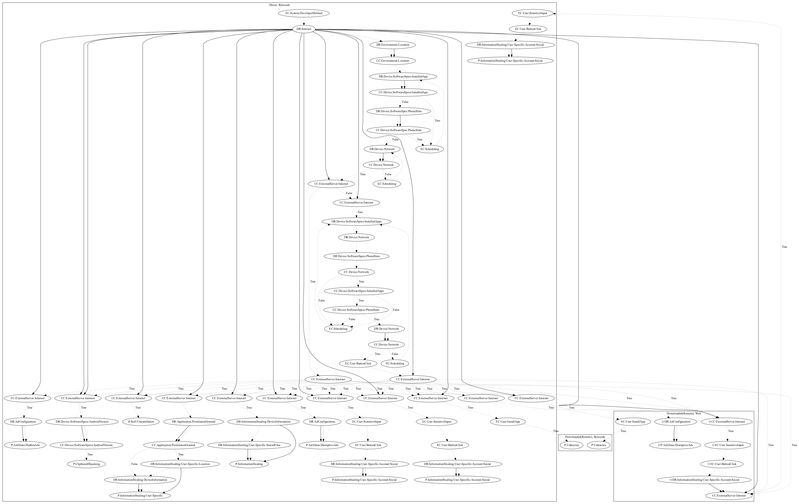

# MobstSpy

## High-level Description

* Year: 2019
* Blog: https://blog.trendmicro.com/trendlabs-security-intelligence/spyware-disguises-as-android-applications-on-google-play/

This malware sample attempts to perform a variety of payloads. The malware activates upon receiving Firebase messages. It then checks whether the user is within a certain location, a camera app is not currently running, and the phone is not within a call. If all passes succeed, the malware checks commands which can perform the following tasks: (1) perform hidden ads, (2) replace contents of the clipboard, (3) perform self-uninstallation, (4) steal device and location information, (5) steal stored files on the device, (6) disruptively push ads to the user, (7) open phishing pages in bytecode, (8) entice the user to install additional unknown payloads, (9) disruptively push ads in a webview (an observed behavior, as the server was down at time of analysis), (10) open google play store in a web page to entice the user to install additional unknown payloads, and (11) open phishing pages on the web (an observed behavior, as the server was down at time of analysis).

## Signature
---

The image of the signature can be downloaded [here](../../img/signatures/MobstSpy.png) for closer inspection.

