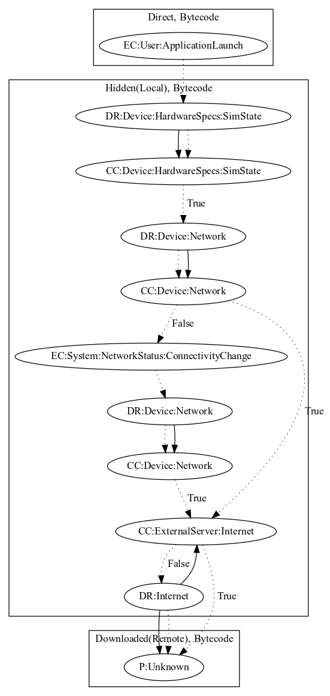

# Necron

## High-level Description

* Year: 2019
* Blog: https://www.kaspersky.com/blog/camscanner-malicious-android-app/28156/

This malware decrypts a payload in local assets which contacts the malware developers server. Upon application launch, the malware checks the sim state to ensure the device is likely real. It then checks network connectivity and dynamically registers on connectivity change system events if not connected to a network. Once the malware has network connectivity, it attempt to download a file from the malware developers server to perform additional unknown payloads.

## Signature
---

The image of the signature can be downloaded [here](../../img/signatures/Necron.png) for closer inspection.

