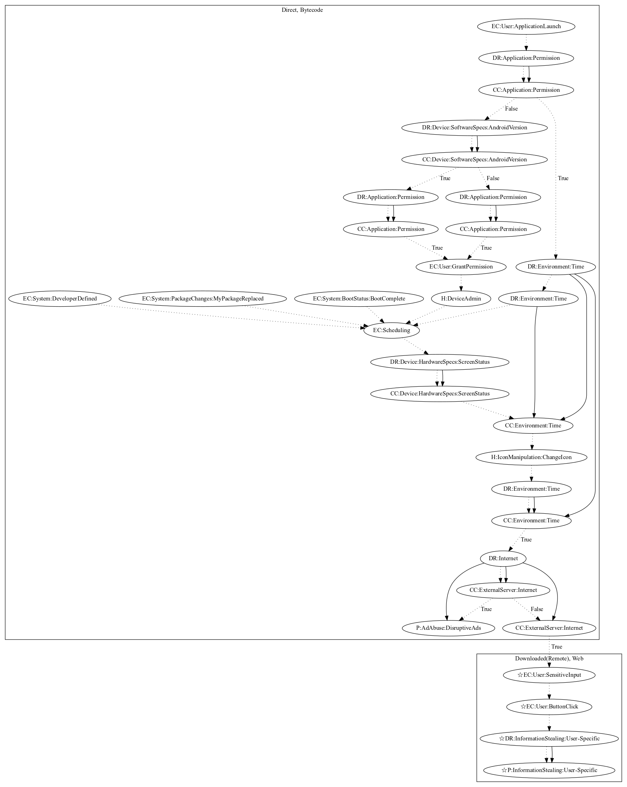

# Reputation1

## High-level Description

* Year: 2018
* Blog: https://www.symantec.com/blogs/threat-intelligence/persistent-malicious-apps-google-play

This malware sample aims to disruptively push ads to the user and steal user-specific information. The malware first requests device admin privileges on launching the application. It then registers a routine that periodically collects commands from the server. This routine activates on developer-defined, package, and boot system events as well. After checking the screen status and that a set period of time has past, the malware changes the app icon and retrieves commands from the malware developers server to perform one the following: (1) display ads disruptively to the user, (2) open a scam link to retrieve user-specific information (an observed behavior as the server was down).

## Signature
---

The image of the signature can be downloaded [here](../../img/signatures/Reputation1.png) for closer inspection.

