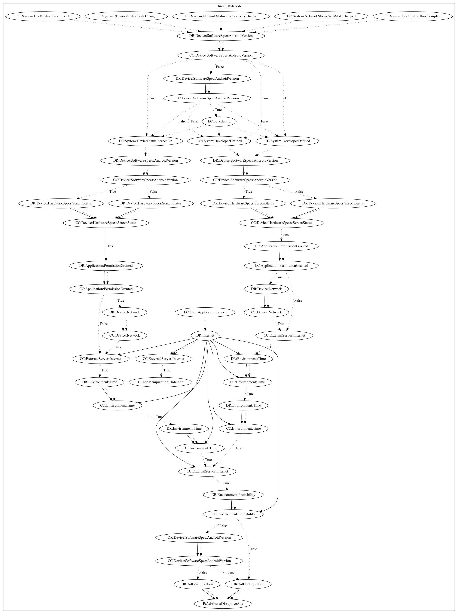

# Reputation1_2019

## High-level Description

* Year: 2019
* Blog: https://symantec-enterprise-blogs.security.com/blogs/threat-intelligence/hidden-adware-google-play

This malware application aims to push full screen ads to the user. The malware retrieves configuration from the internet on application launch. The malware hides the app icon depending on the commands from the server. A wide variety of boot and network system events schedule an alarm to display disruptively display ads after checking the Android version, that the screen is on, a set period of time has passed, and commands from the server enable the malicious behavior. A probability roll and android version check determine the ad configuration to use when displaying ads.

## Signature
---

The image of the signature can be downloaded [here](../../img/signatures/Reputation1_2019.png) for closer inspection.

