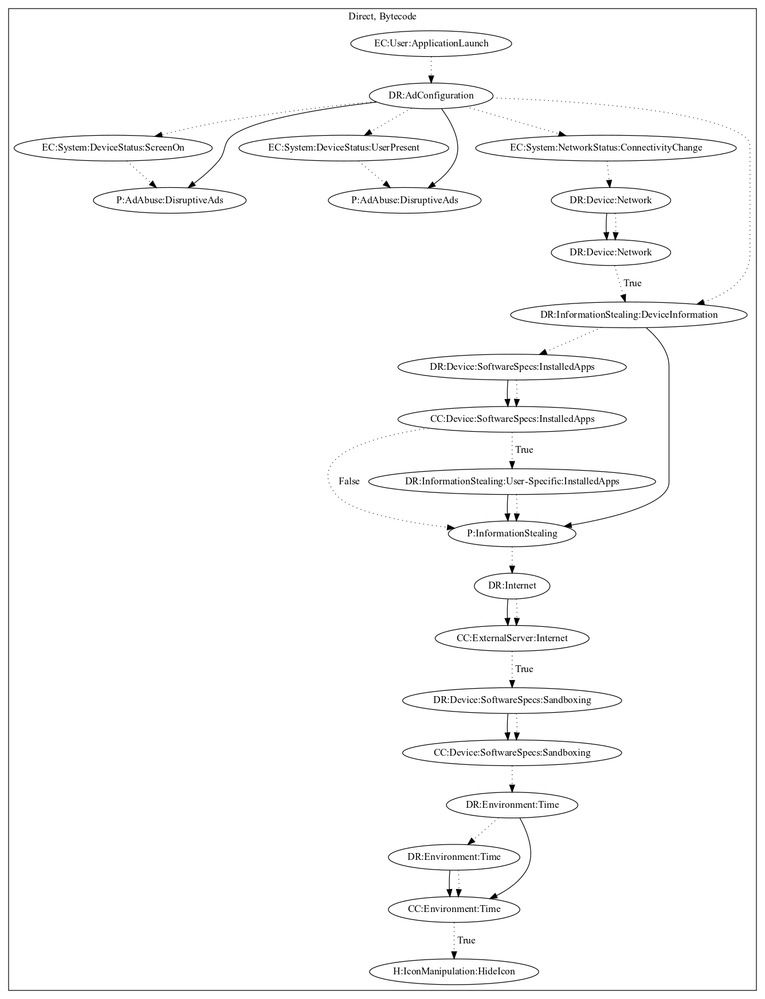

# Reputation2

## High-level Description

* Year: 2018
* Blog: https://blog.trendmicro.com/trendlabs-security-intelligence/apps-disguised-security-tools-bombard-users-ads-track-users-location/

This malware sample contains the ability to push ads disruptively to the user. On application launch, the malware dynamically registers device status events to push ads disruptively to the user. The malware also dynamically registers network status system events that check whether the device has network connectivity. Upon a valid network connection, the malware leaks device and user-specific information. It then checks sandboxing indicators and that a set amount of time has past before hiding the app icon.

## Signature
---

The image of the signature can be downloaded [here](../../img/signatures/Reputation2.png) for closer inspection.

