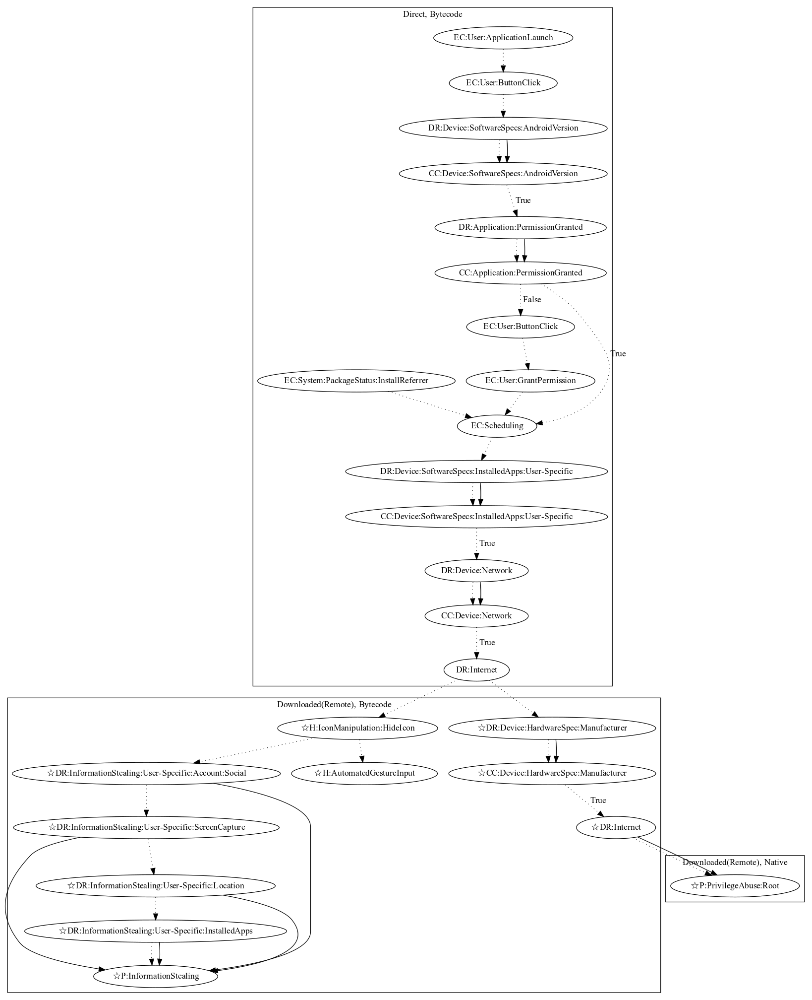

# SideWinder

## High-level Description

* Year: 2020
* Blog: https://www.trendmicro.com/en_us/research/20/a/first-active-attack-exploiting-cve-2019-2215-found-on-google-play-linked-to-sidewinder-apt-group.html

This malware aims to download a remote payload to perform additional malicious behaviors. Upon launching the app, the malware checks the android version and checks permissions. It then schedules checking that the malware does not contain a user-specific app and network connectivity before downloading a remote payload. This scheduling behavior is also picked up by install referrer system events. The additional payload can hide the app icon, checks the device manufacturer before root the device, and steals user-specific information (all observed behaviors, as the server to retrieve the remote payload was down at time of analysis).

## Signature
---

The image of the signature can be downloaded [here](../../img/signatures/SideWinder.png) for closer inspection.

