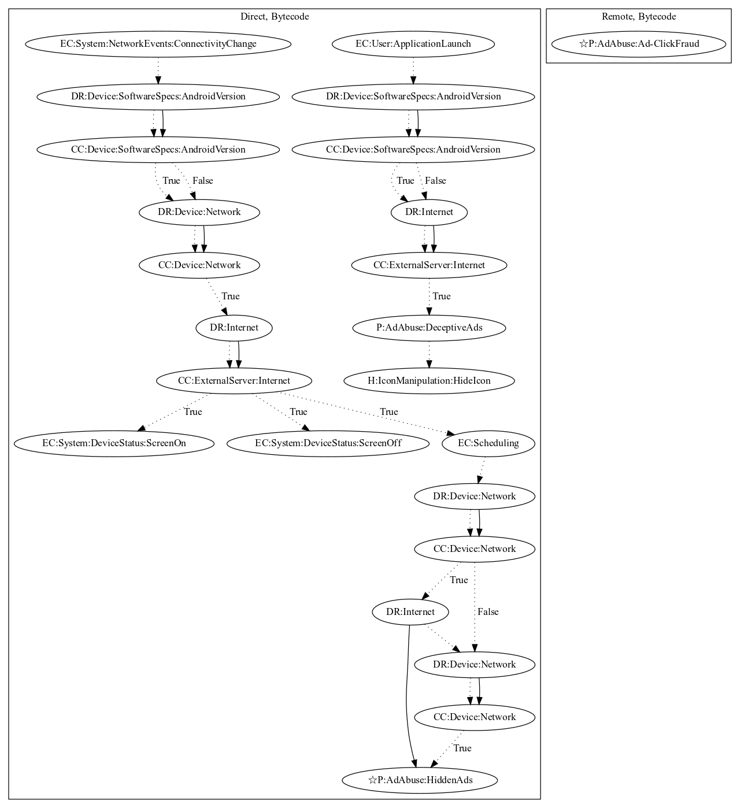

# Simpo

## High-level Description

* Year: 2016
* Blog: https://www.welivesecurity.com/2016/02/24/porn-clicker-trojans-google-play-analysis/

This malware sample aims to perform ad-click fraud. The malware retrieves commands and ad configuration from it's C&C server to register a broadcast receiver on screen on/off system-wide events. These events then schedule tasks used to perform ad-click fraud (an observed behavior, as the server was down). This sample also has the ability to hide it's icon on application launch based on response from it's C&C server. 

## Signature
---

The image of the signature can be downloaded [here](../../img/signatures/Simpo.png) for closer inspection.

