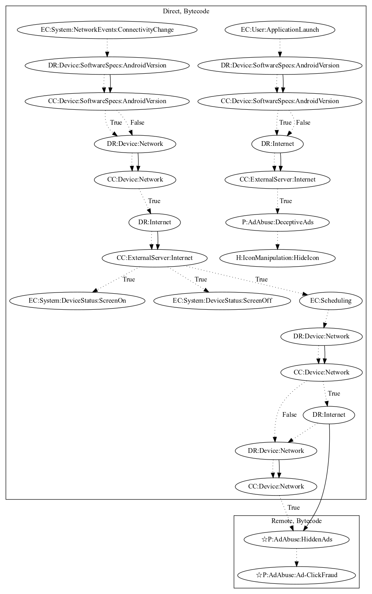

# Simpo

## High-level Description

* Year: 2016
* Blog: https://www.welivesecurity.com/2016/02/24/porn-clicker-trojans-google-play-analysis/

This malware sample aims to perform hidden ads and ad-click fraud. On application launch, the malware retrieves internet configuration and pushes an ad disruptively to the user before hiding the app icon. The malware also listens on network system events. It then checks network connectivity before dynamically registering screen on/off events that aim to enable wifi. It additionally schedules a network check that retrieves a remote payload from the internet that loads ad traffic and performs ad-click fraud (both observed behabiors as the server was down at time of analysis).

## Signature
---

The image of the signature can be downloaded [here](../../img/signatures/Simpo.png) for closer inspection.

