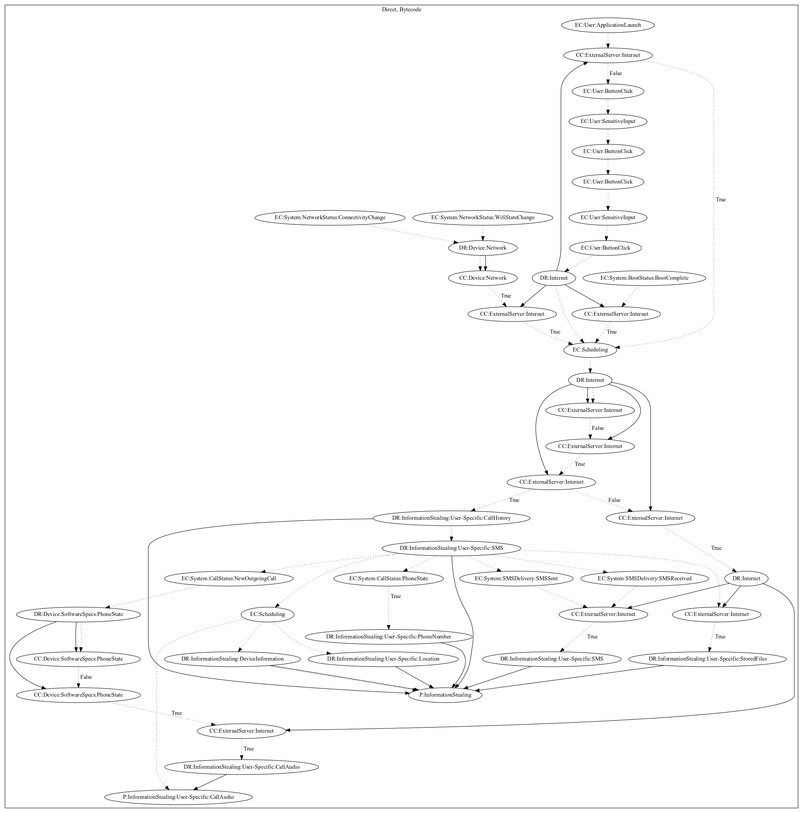

# Smesh

## High-level Description

* Year: 2016
* Blog: https://blog.trendmicro.com/trendlabs-security-intelligence/operation-c-major-actors-also-used-android-blackberry-mobile-spyware-targets/

This malware acts as a chatting application. On application launch, the user goes through a registration process. Afterwards, it creates a persistent connection with the malware developers server. Upon receiving messages from the "admin" user, the app retrieves call history information, dynamically registers a variety of system events to retrieve sms information, phone numbers, and schedules a routine to leak the information along with device and location data. The malware also dynamically registers call status system events to record call audio and leaks it to the malware developers server depending on commands from the server.

## Signature
---

The image of the signature can be downloaded [here](../../img/signatures/Smesh.png) for closer inspection.

