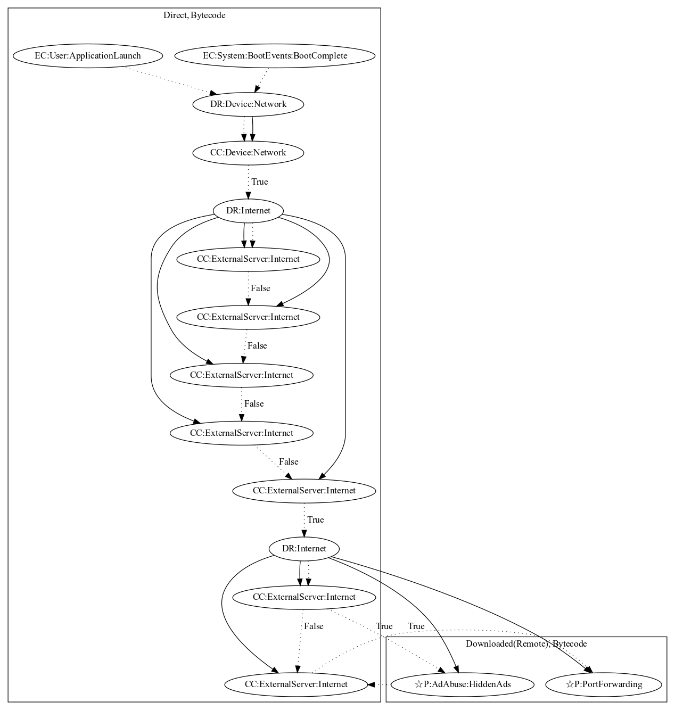

# SockBot

## High-level Description

* Year: 2017
* Blog: https://www.symantec.com/connect/blogs/android-malware-google-play-adds-devices-botnet-and-performs-ddos-attacks

This malware sample aims to perform port forwarding and hidden ads. The malware activates on application launch or boot system events. It first checks network connectivity before retrieving commands from the server to enable a port using SOCKS protocols. Based on data sent from the malware developer server, it contains capabilities of loading network traffic to perform hidden ads or act as a relay to steal data from the internal network (both observed behaviors, as the server was down at time of analysis).

## Signature
---

The image of the signature can be downloaded [here](../../img/signatures/SockBot.png) for closer inspection.

