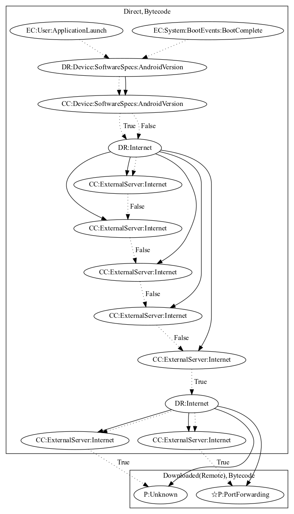

# SocksBotA

## High-level Description

* Year: 2016
* Blog: https://blog.trendmicro.com/trendlabs-security-intelligence/dresscode-potential-impact-enterprises/

This malware application aims to create a port for the malware developer to access the users internal network. The sample registers a broadcast receiver that listens to boot events (Boot Complete) when the application launches. The malware then retrieves configuration from the internet to set up a SOCKS protocol. Depending on commands from the server, the malware can relay data from the internal network to the malware developers server or perform additional unknown behaviors.

## Signature
---

The image of the signature can be downloaded [here](../../img/signatures/SocksBotA.png) for closer inspection.

