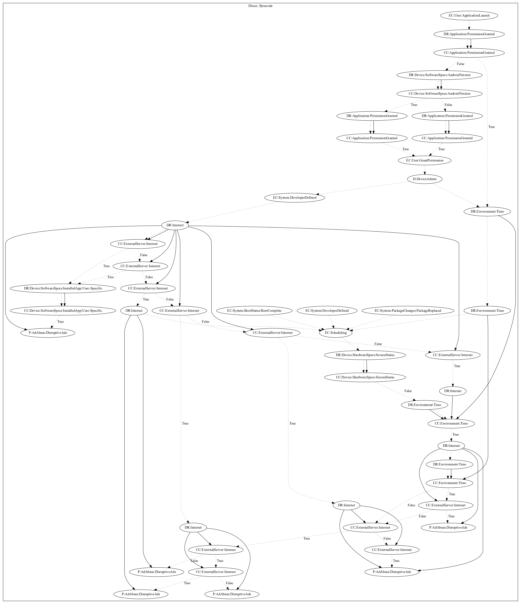

# Solid

## High-level Description

* Year: 2017
* Blog: https://blog.malwarebytes.com/cybercrime/2017/10/mobile-menace-monday-despicable-adware/

This malware sample aims to perform ad abuse. On application launch, the malware checks a series of permissions before requesting device admin privileges and registering a developer defined intent. Based on the developer-defined intent, it retrieves commands from the internet which can disruptively push ads to the user. The malware also listens on boot, developer-defined, and package system events that check the device screen status. It then checks a series of time has past since application launch before retrieving commands from the internet that have capabilities to disruptively push ads to the user. 

## Signature
---

The image of the signature can be downloaded [here](../../img/signatures/Solid.png) for closer inspection.

