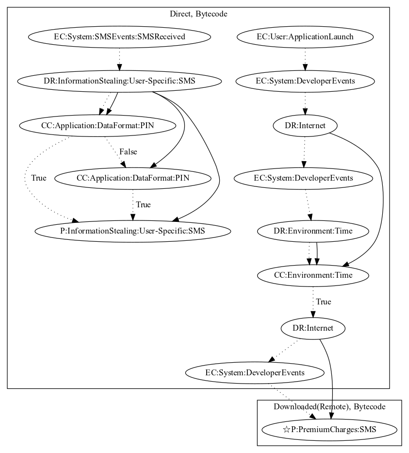

# Sonyvpay

## High-level Description

* Year: 2018
* Blog: https://securingtomorrow.mcafee.com/consumer/consumer-threat-notices/android-users-mobile-billing-fraud-due-to-sonvpay-malware/

This malware sample aims to perform premium charges via SMS. The malware activates on application launch and registers a developer-defined event to retrieve push notifications. It then waits a period of time based on configuration that is sent via push notifications before downloading an executable that performs premium SMS charges (an observed behavior, as the server to retrieve the executable was down). The malware sample also contains capabilities to intercept and leak SMS messages that contain a pin. This malware sample uses two data format checks to identify pin messages from two different premium charge services. 

## Signature
---

The image of the signature can be downloaded [here](../../img/signatures/Sonyvpay.png) for closer inspection.

