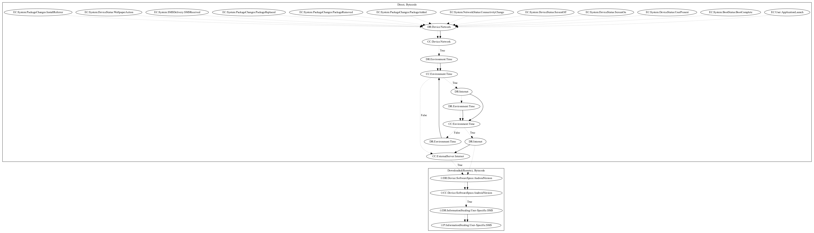

# SpyAgntX

## High-level Description

* Year: 2017
* Blog: https://nakedsecurity.sophos.com/2017/07/27/dont-want-your-smss-stolen-dont-download-these-android-apps/

This malware sample aims to download a payload which performs information stealing. The malware sample retrieves an executable after waiting a certain period of time and retrieving commands from the C&C server. It then aims to steal SMS messages from the user (an observed behavior, as the server to retrieve the payload was down).

## Signature
---

The image of the signature can be downloaded [here](../../img/signatures/SpyAgntX.png) for closer inspection.

