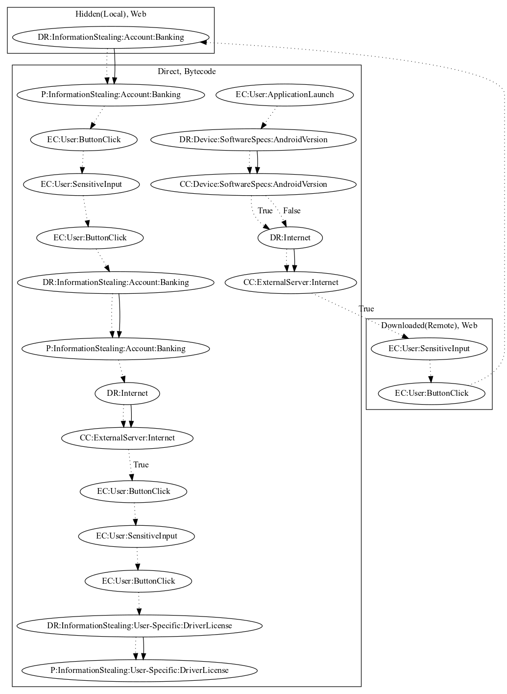

# SpyBankerAIF

## High-level Description

* Year: 2018
* Blog: https://www.welivesecurity.com/2018/09/19/fake-finance-apps-google-play-target-around-world/

This malware sample acts as a fake banking application. Upon launch, the malware checks that the malware developer server is active. It then opens a web page of a banking application where the user can log in. The malware then collects the credentials using a local javascript payload and leaks the information in direct bytecode. It then reveals additional pages to request the user for "verification". The user then inputs personal information (i.e., driver license, phone number, and age). This information is also sent to the malware developers server.

## Signature
---

The image of the signature can be downloaded [here](../../img/signatures/SpyBankerAIF.png) for closer inspection.

