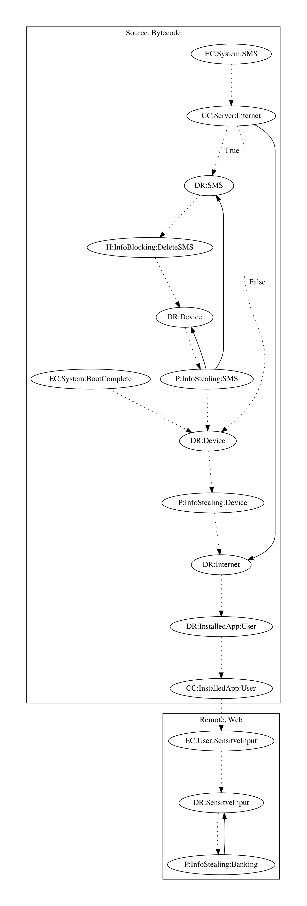

# SpyBankerHU

## High-level Description

* Year: 2017
* Blog: https://www.welivesecurity.com/2017/02/22/sunny-chance-stolen-credentials-malicious-weather-app-found-google-play/

This malware sample contains a wide variety of malicious abilities: it phishes banking credentials, performs ad abuse through notifications, intercepts SMS, and performs requests device admin privileges. the ability to phish banking credentials based on Brazilian banks. The malware schedules an alarm on a variety of system-wide events. 

The malware leaks device information and retrieves commands from the malware developers server. Additionally, the malware requests device admin privileges if not already granted. The malware sample parses the set of commands. If ad configuration is found, the malware sample displays a scam link notification. If the command is to intercept SMS messages, a flag is set to leak SMS messages on SMS Receive system events. Once the malware parses the commands, it checks for installed packages on the device. The malware sample opens a phishing web page if a brazilian bank is found on the device (an observed behavior, as the phishing site was down).

## Signature
---

The image of the signature can be downloaded [here](../../img/signatures/spybankerhu.png) for closer inspection.

