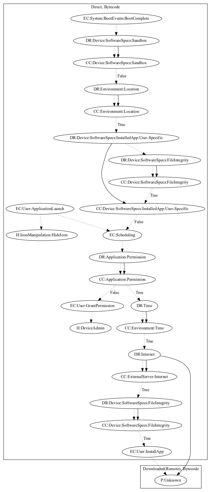

# SpyBankerPV

## High-level Description

* Year: 2017
* Blog: https://www.welivesecurity.com/2017/11/21/new-campaigns-spread-banking-malware-google-play/

This malware sample steal information and perform an unknown payload. The initial activation of the path relies on either (1) the application launching or (2) when the device boots, is not a sandbox, a user-specific application is not already installed, and is not in a specific location (i.e., Russia or Ukraine). It then requests device admin privileges. After a set period of time, it retrieves commands and an executable from it's C&C&C server. Once the user installs the application, it performs an unknown payload. 

## Signature
---

The image of the signature can be downloaded [here](../../img/signatures/SpyBankerPV.png) for closer inspection.

