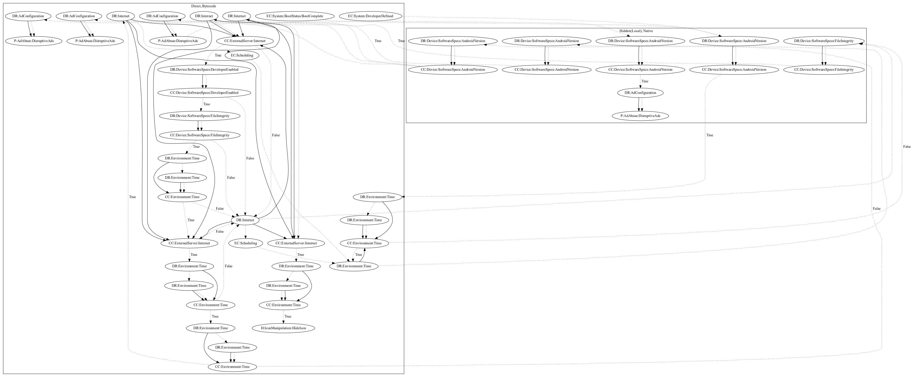

# Tekya

## High-level Description

* Year: 2020
* Blog: https://research.checkpoint.com/2020/google-play-store-played-again-tekya-clicker-hides-in-24-childrens-games-and-32-utility-apps/

This malware attempts to perform ad click fraud. The malware activates on boot and developer-defined system events. It first checks the android version in native code before retrieving configuration from the internet. It then contains several checks for file integrity, whether developer enabled settings are set, and time before pushing ads disruptively to the user. In one case, the malware additionally hooks a native method that performs ad click fraud.

## Signature
---

The image of the signature can be downloaded [here](../../img/signatures/Tekya.png) for closer inspection.

