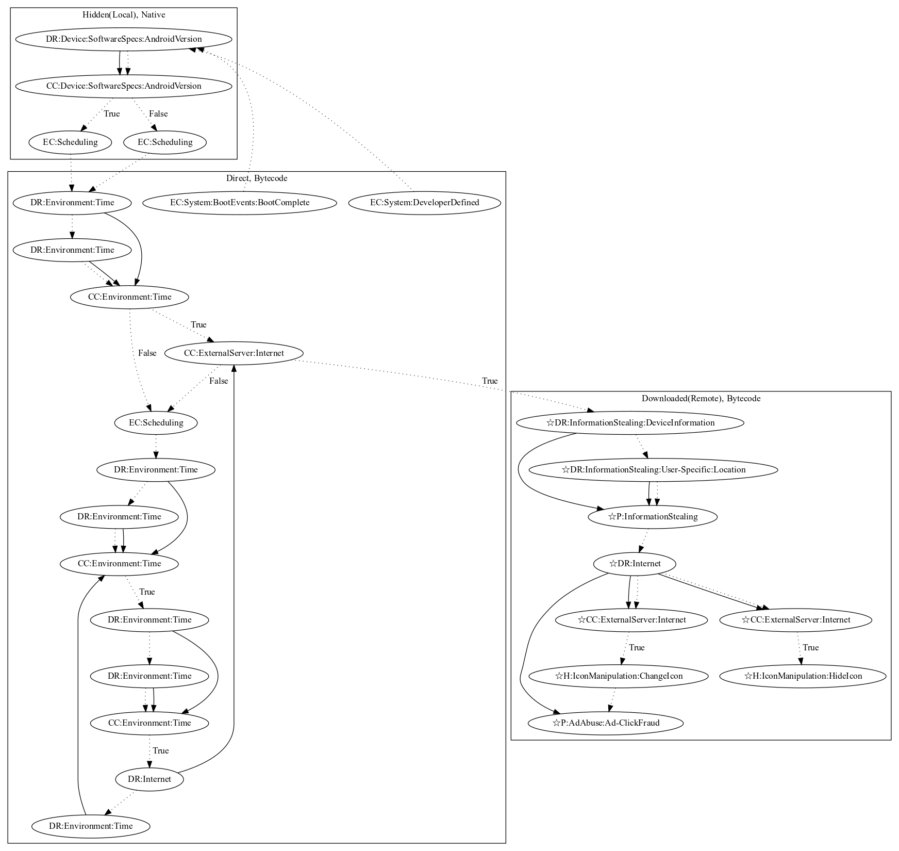

# TekyaHRX

## High-level Description

* Year: 2020
* Blog: https://www.trendmicro.com/en_us/research/20/f/new-tekya-ad-fraud-found-on-google-play.html

This malware attempts to steal information, perform ad-click fraud, and hide/change the app icon. Upon boot and developer-defined events, it checks the android version natively and a routine periodically checks whether a remote payload exists on the device. If it does not exist, the malware waits a set amount of time before downloading the remote payload. Once downloaded, the malware executes the remote payload to steal device/location information, hide/change the app icon, and perform ad-click fraud (all observed behaviors as the server was down at time of analysis).

## Signature
---

The image of the signature can be downloaded [here](../../img/signatures/TekyaHRX.png) for closer inspection.

