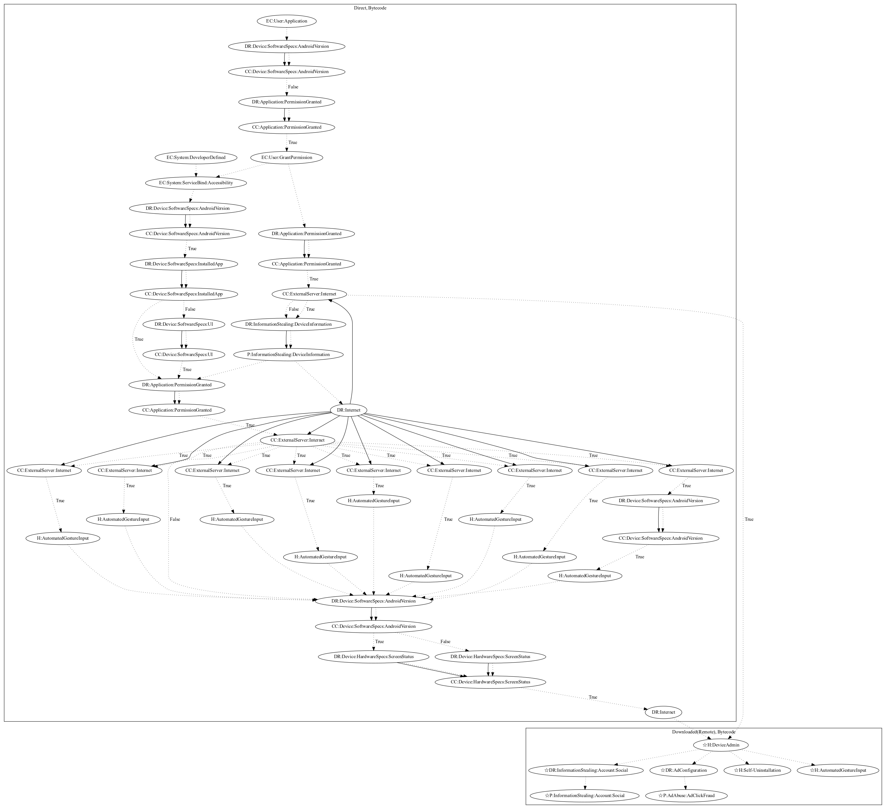

# ToastAmigo

## High-level Description

* Year: 2017
* Blog: https://blog.trendmicro.com/trendlabs-security-intelligence/toast-overlay-weaponized-install-android-malware-single-attack-chain/

This malware sample aims to perform ad-click fraud and steal user information. On application launch, the malware requests accessibility permissions. On granting accessibility permissions, the malware leaks device information and retrieves configuration that defines tasks the malware can perform. Based on the tasks, the malware can perform a wide variety of automated gesture input commands to automatically perform tasks (e.g., install an additional application, grant permissions, etc.). The malware then downloads an additional remote payload and installs the application. The remote payload contains abilities to request device admin privileges, perform self-uninstallation, steal social accounts, and perform ad-click fraud (all observed, as the server used to retrieve the payload was down at time of analysis). In addition, the malware listens on accessibility for certain installed applications and runs tasks defined by configuration to perform automated gesture input (e.g., clicking back if the user accesses the device settings).

## Signature
---

The image of the signature can be downloaded [here](../../img/signatures/ToastAmigo.png) for closer inspection.

