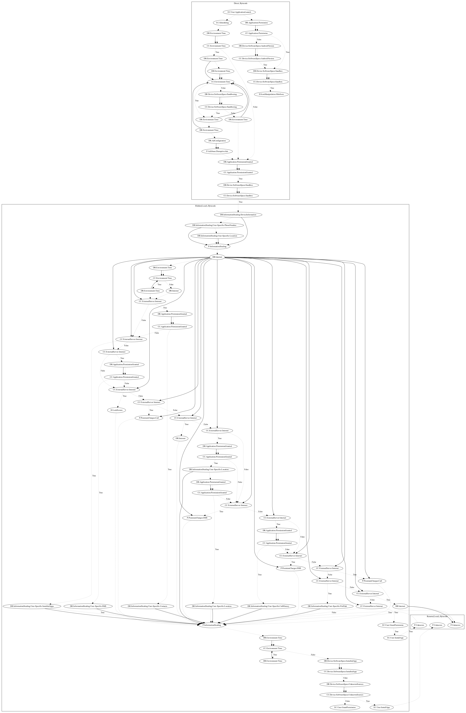

# TrojanDropperAgentCIQ

## High-level Description

* Year: 2018
* Blog: https://www.welivesecurity.com/2018/10/24/banking-trojans-continue-surface-google-play/

This malware sample aims to steal a wide variety of user-specific information from the user, perform premium charges, and perform additional unknown payloads. On application launch, the malware checks for sandboxing before hiding the app icon. The malware also contains time and sandbox checks before loading a local payload. The local payload leaks device and user-specific information to the malware developers server and retrieves a set of commands which can perform the following: (1) call a premium number, (2) perform premium charges via SMS, (3) retrieve location data, (4) retrieve file paths, (5) download and invoke methods from a remote payload to perform unknown behaviors, (6) retrieve call history data, (7) retrieve SMS data, (8) retrieve contacts, (9) retrieve installed apps, (10) request the installation of an unknown payload.

## Signature
---

The image of the signature can be downloaded [here](../../img/signatures/TrojanDropperAgentCIQ.png) for closer inspection.

