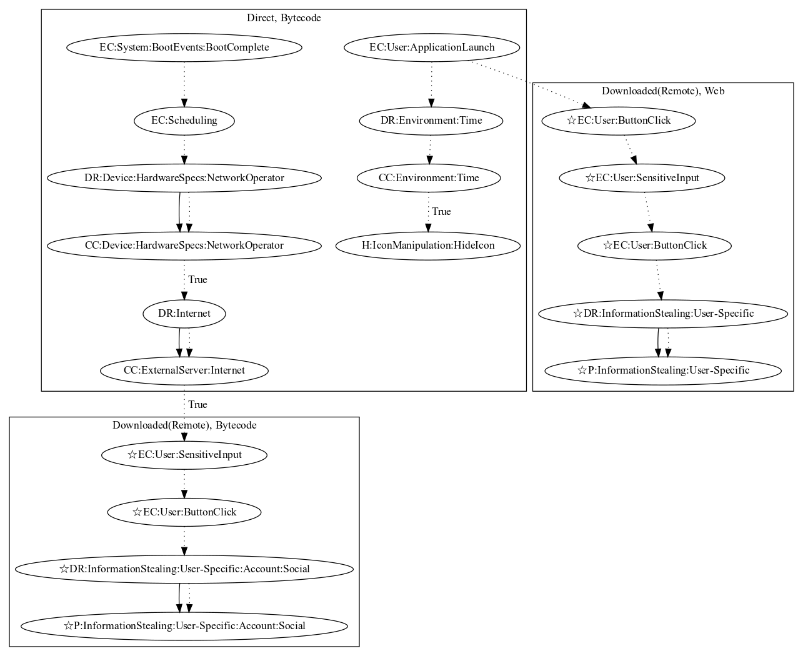

# TrojanAgentDropperGY

## High-level Description

* Year: 2016
* Blog: https://www.welivesecurity.com/2016/08/03/fake-prisma-apps-found-google-play/

This malware sample aims to steal user information. The malware sample schedules a task that checks the current network operator of the device. It also retrieves commands and an executable that opens a login page to steal the user's social account (an observed behavior, as the server to download the executable was down). In addition to stealing social accounts, the malware sample opens scam links on application launch (an observed behavior, as the phishing site was down). User-specific information entered witin the scam link is sent to the malware developer.

## Signature
---

The image of the signature can be downloaded [here](../../img/signatures/TrojanDropperAgentGY.png) for closer inspection.

