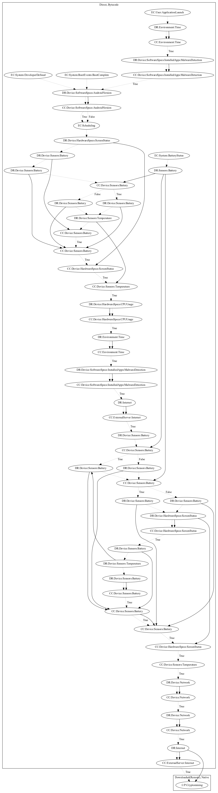

# Vilny

## High-level Description

* Year: 2018
* Blog: https://www.kaspersky.com/blog/google-play-hidden-miners/21882/

This malware sample aims to perform cryptocurrency mining. The malware sample schedules an alarm to start mining after a certain time period has passed on launching the application or when the device boots. It then checks to ensure the device has enough battery, temperature is low enough, and screen is off. The malware sample retrieves mining configuration and an executable from the malware developer's server to mine cryptocurrency natively (an observed behavior, as the server to retrieve the executable was down).

## Signature
---

The image of the signature can be downloaded [here](../../img/signatures/Vilny.png) for closer inspection.

